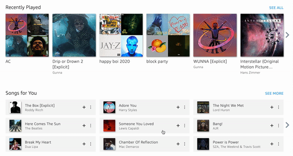
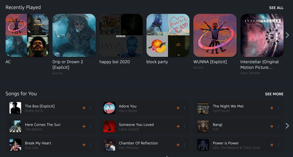

# __Reduce Eye Strain on AmazonMusic Site :musical_note:__

## __About__
#### Hello! Inspired from many "Dark Mode" UIs, I wanted to create one for the Amazon Music website so my eyes don't hurt when I'm working late at night. I wanted the text to be easier to read and album images to look more modern. So, with some CSS magic, here it is!

#### I came across [this post](https://blog.lateral.io/2016/04/create-chrome-extension-modify-websites-html-css/) leading me to [this repository](https://github.com/lateral/chrome-extension-blogpost) when researching how to get started

## __Select Features__
#### For testing, I've been running this as an extension on Chrome (not public).   
#### See the sections below for a quick preview!

#### __Home Page__
<table border="0">
 <tr>
    <td><b style="font-size:15px">Before</b></td>
    <td><b style="font-size:15px">After</b></td>
 </tr>
 <tr>
    <td></td>
    <td></td>
 </tr>
</table>

#### __Song List, Albums, & Playlists__
<table border="0">
 <tr>
    <td><b style="font-size:15px">Before</b></td>
    <td><b style="font-size:15px">After</b></td>
 </tr>
 <tr>
    <td></td>
    <td></td>
 </tr>
</table>

#### __Lyrics__
<table border="0">
 <tr>
    <td><b style="font-size:15px">Before</b></td>
    <td><b style="font-size:15px">After</b></td>
 </tr>
 <tr>
    <td></td>
    <td></td>
 </tr>
</table>

#### __Search & Horizontal Header__

#### __Side Menu__

## __:bangbang: IMPORTANT__
#### This project currently does NOT have a license. Based on github's guidance from [this link](https://choosealicense.com/no-permission/), please contact me directly for permission to use any portions of the software in [this repository (dev-bhatia/amazonMusicDarkUI)](https://github.com/dev-bhatia/amazonMusicDarkUI).

## __Thanks for stopping by!__
####  :man_astronaut: Get in touch for questions, suggestions, etc.  
#### :mailbox_with_mail: [devjbhatia@gmail.com](devjbhatia@gmail.com)
#### :handshake: [Connect on LinkedIn!](https://www.linkedin.com/in/dev-bhatia/)
